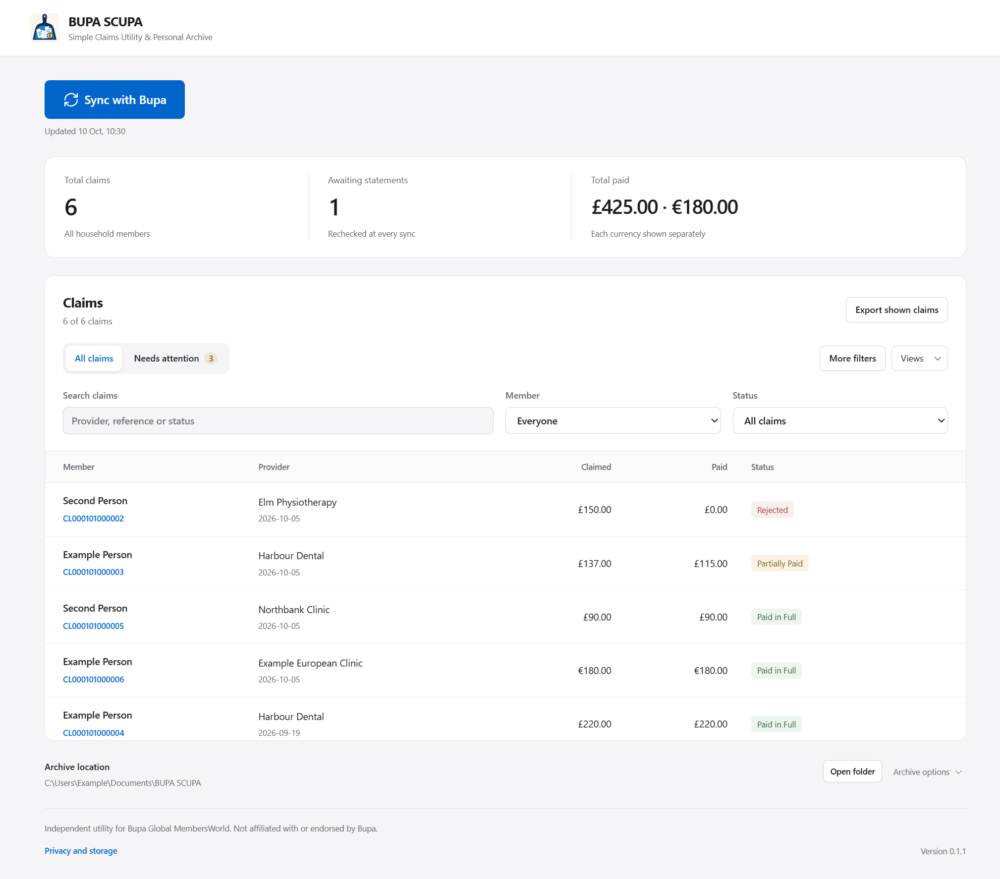

# BUPA SCUPA

Simple Claims Utility & Personal Archive — a free, open-source Windows app for
your household's **Bupa Global MembersWorld** claims.

Download statements, track payments, search and filter claims, and export CSV.
Your PDFs and claim history stay in an archive on your computer.



## Get started

Requires Windows 10/11 x64 and Microsoft Edge or Google Chrome.

[Download the latest release](https://github.com/alanmosely/bupa-scupa/releases/latest)
as a portable EXE or ZIP.
Open the EXE, or extract the ZIP and run `BUPA SCUPA.exe`.

1. Choose an archive folder or keep the default `Documents/BUPA SCUPA`.
2. Click **Sync with Bupa**, sign in and complete MFA in the browser.
3. Confirm your household and each member's first import. Keep both windows open
   until sync finishes.

Browse saved claims offline, filter by member or status, and open the original PDFs.
Back up your archive regularly.

## Agents and scripts

Agents can query claims and payment totals through the [local JSON API](AGENT_API.md).
From a source checkout:

```powershell
node src/agent.js report --data-dir "D:\PrivateArchive"
```

Use `schema` to discover commands, `status` to inspect the archive, and `claims`
for individual records. Commands return JSON.

## Documentation

- [Archive and backups](docs/ARCHIVE.md) · [Privacy](PRIVACY.md)
- [Contributing](CONTRIBUTING.md) · [Architecture](docs/ARCHITECTURE.md)
- [Security](SECURITY.md)

To run from source with Node.js 22.13+: `npm ci`, `npm run vendor`, then `npm start`.

Independent project, not affiliated with or endorsed by Bupa.
Licensed under [GPL-3.0-or-later](LICENSE). See [third-party notices](NOTICE).
